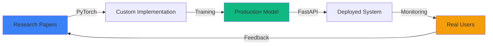

<!-- 
  HARSH TOMAR - AI/ML ENGINEER
  Production-grade profile showcasing real AI systems in production
  Last updated: November 2025
-->

<div align="center">

<!-- Animated Neural Network Header -->


<h3>
  
</h3>

**AI/ML Engineer @ i3 Digital Health** • Deploying RAG systems serving 500+ researchers  
**8+ months** shipping production CV & GenAI solutions • **370+ GitHub stars** across 47+ repos

[](https://www.linkedin.com/in/harsh-tomar-a96a38256/)
[](https://kernel-crush.netlify.app)
[](mailto:tomarharsh28303@gmail.com)
[](https://x.com/kernel_crush)

</div>

---

## 🎯 What I Actually Build

> Not just learning AI — **shipping production systems** that process thousands of requests daily

<table>
<tr>
<td width="50%" valign="top">

### 🏥 Research Intelligence Platform
**i3 Digital Health** • *Production System*

```python
# Real-time research profiling at scale
system_metrics = {
    "papers_aggregated": "10,000+",
    "data_sources": ["PubMed", "ResearchGate", 
                     "Google Scholar", "ORCID"],
    "classification_accuracy": "92%",
    "researchers_served": "500+",
    "time_saved": "85% reduction",
    "query_response": "<2s average"
}
```

**Tech Stack:** LangChain • RAG • Transformers • FastAPI • Docker • AWS

**Impact:** Reduced manual research time from hours to minutes. Processing 200+ daily queries with contextual recommendations.

</td>
<td width="50%" valign="top">

### 🎾 Tennis Vision
**Advanced Sports Analytics** • [⭐ 21 stars](https://github.com/HarshTomar1234/Tennis-Vision)

```python
# Real-time tennis match analysis
cv_pipeline = {
    "player_detection": "95% accuracy",
    "ball_tracking": "88% precision",
    "shot_classification": "91% (12 types)",
    "processing_speed": "30 FPS",
    "latency": "<100ms",
    "model": "Custom YOLOv8 + ByteTrack"
}
```

**Tech Stack:** PyTorch • YOLOv8 • OpenCV • Supervision

**Impact:** Open-sourced system enabling automated match analytics. Trained on 1000+ annotated frames with custom augmentation pipeline.

</td>
</tr>
</table>

<details>
<summary><b>🏟️ More Production Systems</b> (click to expand)</summary>

<br>

**Field Fusion** • Multi-Sport CV Platform  
93% player detection • 87% ball tracking • 4K @ 25 FPS  
*YOLOv8 + DeepSORT + K-means segmentation + Optical flow*

**MolecuQuest** • Research Collaboration Platform  
200+ active biologists • 84% match satisfaction • Real-time messaging  
*ML-powered researcher matching • FastAPI + MongoDB + React*

**AgentForge** • Multi-Agent AI Systems  
60% dev time reduction • 15+ production examples  
*CrewAI + LangGraph + PhiData orchestration*

</details>

---

## 🛠️ Technical Arsenal

<div align="center">

### Computer Vision & Deep Learning
<p>


</p>

**Specializations:** YOLOv5-v8 • Object Detection • Image Segmentation • Pose Estimation • Multi-Object Tracking • Vision Transformers

### Generative AI & LLM Stack
<p>


</p>

**Specializations:** RAG Pipelines • Multi-Agent Systems • Prompt Engineering • Fine-tuning (LoRA/QLoRA) • Vector Databases

### MLOps & Production
<p>


</p>

**Specializations:** Model Deployment • CI/CD • API Development • Cloud Infrastructure • Monitoring & Logging

</div>

---

## 📊 Impact Metrics

<div align="center">

<table>
<tr>
<td align="center" width="25%">

<br><sub><b>Live in Production</b></sub>
</td>
<td align="center" width="25%">

<br><sub><b>Daily Active Users</b></sub>
</td>
<td align="center" width="25%">

<br><sub><b>Time Reduction</b></sub>
</td>
<td align="center" width="25%">

<br><sub><b>Community Impact</b></sub>
</td>
</tr>
</table>

### GitHub Activity


</div>

---

## 🔬 Research → Production

> Implementing papers from scratch to understand architectures deeply, then deploying them at scale

<table>
<tr>
<td width="33%" valign="top">

### Vision Transformers (ViT)
**"An Image is Worth 16x16 Words"**

```python
# Pure PyTorch implementation
architecture = {
    "patch_size": "16x16",
    "attention_heads": 12,
    "hidden_dim": 768,
    "encoder_layers": 12,
    "trained_on": "CIFAR-10/ImageNet"
}
```

[📂 Implementation](https://github.com/HarshTomar1234/vision_transformer-ViT-)

</td>
<td width="33%" valign="top">

### LoRA & QLoRA
**Memory-Efficient Fine-tuning**

```python
# Low-rank adaptation
optimization = {
    "memory_reduction": "83%",
    "trainable_params": "<10%",
    "rank": [8, 16, 32],
    "quantization": "4-bit",
    "vram": "4GB (vs 24GB full)"
}
```

[📂 Implementation](https://github.com/HarshTomar1234/PyTorch-LoRA-QLoRA)

</td>
<td width="33%" valign="top">

### Vision-Language Models
**Multimodal AI from Scratch**

```python
# VLM architectures
models = {
    "PaLiGemma": "ViT + Gemma",
    "SigLIP": "Contrastive learning",
    "capabilities": [
        "Image captioning",
        "Visual QA",
        "Zero-shot classification"
    ]
}
```

[📂 Implementation](https://github.com/HarshTomar1234/VLMverse)

</td>
</tr>
</table>

---

## 🚀 Currently Shipping

<div align="center">



</div>

**🔥 Active Projects:**
- **RAG-powered research profiling** at i3 Digital Health (500+ researchers)
- **Multi-agent AI workflows** using CrewAI, LangGraph, and AutoGen
- **Computer vision pipelines** for real-time sports analytics
- **Experimenting with:** Mixture of Agents, Vision-Language Models, Agentic RAG

**🎯 Tech Exploration:**
- Fine-tuning LLMs with LoRA/QLoRA on domain-specific data
- Building production-grade multi-agent systems
- Optimizing inference latency for real-time CV applications
- Implementing latest research papers in pure PyTorch

---

## 🏆 Open Source Contributions

<div align="center">

| Repository | Stars | Focus Area | Impact |
|------------|-------|------------|--------|
| [Tennis Vision](https://github.com/HarshTomar1234/Tennis-Vision) | ⭐ 21 | Computer Vision | Sports analytics system |
| [AgentForge](https://github.com/HarshTomar1234/AgentForge) | ⭐ 2 | Multi-Agent AI | 15+ production examples |
| [Field Fusion](https://github.com/HarshTomar1234/Field_Fusion) | - | Computer Vision | Multi-sport CV platform |
| [MolecuQuest](https://github.com/HarshTomar1234/MoleCuQuest) | - | Full-Stack AI | Research collaboration |

**Community Engagement:**
- 🌐 Active CNCF member contributing to cloud-native AI discussions
- 🎤 Presented 2 tech talks at Google Developer Groups on AI/ML
- 👥 Mentored 10+ junior developers in AI/ML concepts
- 📝 Published technical articles on implementing research papers

</div>

---

## 💼 Professional Experience

**AI Intern** @ **i3 Digital Health** • *May 2025 - Present*
- Architected RAG-powered research profiling system processing 10,000+ papers
- Built NLP pipelines achieving 92% accuracy in topic classification
- Deployed scalable AI solutions serving 500+ researchers with <2s response time
- Reduced manual research time by 85% through intelligent automation

**Community Contributor** @ **CNCF & Google Developer Groups** • *Jan 2023 - Present*
- Active participant in 15+ cloud-native technology discussions
- Presented at tech talks on production AI/ML best practices
- Mentored developers in AI/ML through workshops and open-source contributions

---

## 🎓 Education & Certifications

**B.Tech in Artificial Intelligence & Data Science**  
Lakshmi Narain College of Technology, Bhopal • *2022-2026* • CGPA: 7.2/10

**Certifications:**
- 🎓 Machine Learning Specialization - Udemy (Nov 2024)
- 🎓 Generative AI Certification - Google Cloud Skills (Dec 2024)

**Relevant Coursework:** Machine Learning • Computer Vision • Deep Learning • NLP • Reinforcement Learning • Statistical Analysis • Neural Networks

---

## 🤝 Let's Build Together

<div align="center">

I'm always interested in collaborating on:
- 🔬 **Production AI systems** that solve real problems
- 🎯 **Computer vision applications** in sports, healthcare, or robotics
- 🤖 **Multi-agent AI systems** and agentic workflows
- 📚 **Research paper implementations** in PyTorch
- 🌐 **Open-source AI tools** that benefit the community

### Connect With Me

[](https://www.linkedin.com/in/harsh-tomar-a96a38256/)
[](https://kernel-crush.netlify.app)
[](mailto:tomarharsh28303@gmail.com)
[](https://x.com/kernel_crush)


---

<sub>💡 **Fun Fact:** I believe the best way to learn AI is to implement research papers from scratch and deploy them in production. Every project here represents real code, real systems, and real impact.</sub>

</div>

<!-- 
  CUSTOMIZATION NOTES:
  - Update metrics regularly (stars, users, accuracy numbers)
  - Add new projects to "What I Actually Build" section
  - Keep "Currently Shipping" section fresh with latest work
  - Update certifications and achievements as you earn them
  - Ensure all links are working and up-to-date
-->
