<div align="center">


</div>

<div align="center">

```ascii
╔══════════════════════════════════════════════════════════════════════════╗
║  Transforming Research Papers → Production Systems                       ║
║  Building AI that sees, understands, and learns                          ║
╚══════════════════════════════════════════════════════════════════════════╝
```

[](https://www.linkedin.com/in/harsh-tomar-a96a38256/)
[](https://x.com/kernel_crush)
[](https://kernel-crush.netlify.app)
[](mailto:tomarharsh28303@gmail.com)


</div>

---

<div align="center">

## About Me

</div>

**AI/ML Engineer** specializing in **Computer Vision** and **Generative AI** | B.Tech in AI & Data Science

I architect end-to-end AI systems—from implementing cutting-edge research papers in pure PyTorch to deploying production-grade solutions. My work spans computer vision pipelines, multi-agent frameworks, and LLM applications, with a focus on practical implementation over theoretical knowledge.

**Core Competencies:**

```python
expertise = {
    "computer_vision": ["Object Detection & Tracking", "Image Segmentation", 
                       "Pose Estimation", "Sports Analytics", "Medical Imaging"],
    "deep_learning": ["Vision Transformers", "LoRA/QLoRA Fine-tuning", 
                     "Vision-Language Models", "Custom Architectures"],
    "generative_ai": ["Multi-Agent Systems", "RAG Pipelines", "LLM Fine-tuning",
                     "Prompt Engineering", "AI Agents"],
    "mlops": ["Model Deployment", "API Development", "Docker", 
             "Cloud Infrastructure", "Monitoring & Logging"]
}
```

---

<div align="center">

## Technology Arsenal


</div>

### Core Technologies

<p align="center">
  
  
  
  
  
</p>

<p align="center">
  
  
  
  
  
  
  
  
  
  
  
  
  
  
  
  
  
  
  
  
  
</p>

<table align="center">
<tr>
<td align="center" width="25%">
<b>Deep Learning Frameworks</b><br><br>
PyTorch • TensorFlow • Keras<br>
Hugging Face Transformers<br>
Scikit-learn • XGBoost
</td>
<td align="center" width="25%">
<b>Computer Vision</b><br><br>
OpenCV • YOLO (v5/v8/v11)<br>
Ultralytics • Supervision<br>
Roboflow • Albumentations
</td>
<td align="center" width="25%">
<b>Generative AI & LLMs</b><br><br>
LangChain • LangGraph • CrewAI<br>
LlamaIndex • Ollama<br>
Google ADK • AutoGen
</td>
<td align="center" width="25%">
<b>MLOps & Tools</b><br><br>
Docker • Git • FastAPI<br>
Streamlit • Gradio<br>
GCP • Firebase • REST APIs
</td>
</tr>
</table>

---

<div align="center">

## Featured Projects


</div>

<div align="center">
<table>
<tr>
<td align="center" width="33%">
<br>
<b>Computer Vision</b><br>
<sub>Sports Analytics • Medical Imaging</sub>
</td>
<td align="center" width="33%">
<br>
<b>Generative AI</b><br>
<sub>Multi-Agent Systems • RAG</sub>
</td>
<td align="center" width="33%">
<br>
<b>Research</b><br>
<sub>ViT • LoRA • VLMs</sub>
</td>
</tr>
</table>
</div>

### Production Computer Vision Systems

<details open>
<summary><b>🎾 Tennis Vision - Advanced Sports Analytics Platform</b></summary>
<br>

**End-to-end computer vision system for professional tennis match analysis**

Real-world implementation of multiple CV techniques including object detection, tracking, and trajectory prediction for automated sports analytics.

```
Key Features:
├── Multi-player tracking with Re-identification
├── Ball trajectory prediction & speed calculation
├── Court keypoint detection & perspective transform
├── Automated shot classification (forehand/backhand/serve)
└── Real-time performance metrics dashboard
```

**Technical Implementation:** YOLOv8 for detection | ByteTrack for multi-object tracking | OpenCV for image processing | Custom CNN for shot classification

**Impact:** Automated analysis pipeline reducing manual annotation time by 90%

[View Project →](https://github.com/HarshTomar1234/Tennis-Vision) | [Read Technical Deep Dive →](https://www.notion.so/Tennis-Vision-25b4df040c1480d1840ad41d281672f3)

</details>

<details>
<summary><b>⚽ Field Fusion - Soccer Intelligence Platform</b></summary>
<br>

**Real-time player tracking and team performance analytics for soccer**

Production-grade system for tactical analysis with camera movement compensation and automated team segmentation.

```
Pipeline Architecture:
├── Player detection & tracking (YOLO + DeepSORT)
├── Team segmentation (K-means clustering)
├── Camera movement compensation
├── Speed & distance metrics calculation
└── Heatmap generation for tactical analysis
```

**Technical Stack:** YOLO | OpenCV | Supervision library | NumPy for optimization

[View Project →](https://github.com/HarshTomar1234/Field_Fusion)

</details>

<details>
<summary><b>🏥 Breast Cancer Predictor - Clinical ML System</b></summary>
<br>

**High-accuracy diagnostic support system for medical professionals**

Production ML system with 97.8% accuracy, featuring ensemble methods and an interactive web interface for clinical decision support.

```
System Components:
├── Ensemble model (Random Forest + XGBoost)
├── Feature importance analysis
├── Interactive diagnostic dashboard
├── Real-time prediction API
└── Comprehensive medical visualization
```

**Technical Implementation:** Scikit-learn | XGBoost | Streamlit | REST API

[View Project →](https://github.com/HarshTomar1234/BREAST-CANCER-STREAMLIT-APP)

</details>

<details>
<summary><b>🗓️ Elena Calendar Assistant - AI Agent</b></summary>
<br>

**Voice-powered intelligent agent for calendar management**

Multi-modal AI agent leveraging NLP and Google ADK for natural conversation-based calendar operations.

```
Agent Capabilities:
├── Natural language understanding
├── Multi-intent handling
├── Context-aware responses
├── Google Calendar API integration
└── Voice command processing
```

**Framework:** Google Agent Development Kit | LangChain | Speech Recognition

[View Project →](https://github.com/HarshTomar1234/Calendar-Voice-Assistant)

</details>

<details>
<summary><b>🧬 MoleCuQuest - Molecular Research Collaboration Platform</b></summary>
<br>

**Connecting biologists and medical researchers for collaborative molecular discovery**

Full-stack platform built with modern web technologies enabling researchers to collaborate on molecular biology projects and share findings.

```
Platform Features:
├── Researcher collaboration tools
├── Molecular data visualization
├── Project management system
├── Real-time collaboration
└── Research paper integration
```

**Technical Stack:** TypeScript | React | Firebase | Node.js

[View Project →](https://github.com/HarshTomar1234/MoleCuQuest)

</details>

<details>
<summary><b>✈️ Travel Planner - AI-Powered Travel Assistant</b></summary>
<br>

**Intelligent multi-agent system for comprehensive travel planning**

Built using Google Agent Development Kit, this system orchestrates multiple AI agents to handle flight bookings, hotel recommendations, itinerary planning, and local attractions.

```
Agent System:
├── Flight search agent
├── Hotel recommendation agent
├── Itinerary planning agent
├── Budget optimization agent
└── User preference learning
```

**Framework:** Google ADK | Streamlit | Multi-Agent Orchestration

[View Project →](https://github.com/HarshTomar1234/Travel-Planner)

</details>

---

<div align="center">


</div>

### Research Paper Implementations

<div align="center">

> Building research papers from scratch to understand the fundamentals


</div>

<table>
<tr>
<td width="33%">

**Vision Transformers (ViT)**

*"An Image is Worth 16x16 Words"*

Pure PyTorch implementation of the groundbreaking transformer architecture for computer vision, demonstrating patch embedding, positional encoding, and multi-head self-attention.

```python
class ViT:
    - Patch Embedding
    - Position Embedding
    - Transformer Encoder
    - MLP Head
```

[**→ View Implementation**](https://github.com/HarshTomar1234/vision_transformer-ViT-)

</td>
<td width="33%">

**LoRA & QLoRA**

*Memory-Efficient Fine-tuning*

From-scratch implementation of Low-Rank Adaptation techniques for efficient model fine-tuning. Demonstrates parameter-efficient training of large models with minimal memory footprint.

```python
class LoRA:
    - Low-Rank Matrices
    - 4-bit Quantization
    - Adapter Layers
    - Efficient Training
```

[**→ View Implementation**](https://github.com/HarshTomar1234/PyTorch-LoRA-QLoRA)

</td>
<td width="33%">

**VLMverse**

*Vision-Language Models*

Implementation of multimodal architectures (PaLiGemma, SigLIP) that bridge computer vision and NLP for unified understanding of images and text.

```python
class VLM:
    - Image Encoder
    - Text Encoder  
    - Cross-Modal Fusion
    - Joint Training
```

[**→ View Implementation**](https://github.com/HarshTomar1234/VLMverse)

</td>
</tr>
</table>

---

<div align="center">


### Multi-Agent Systems & AI Frameworks


</div>

| Framework | Focus | Key Features | Repository |
|-----------|-------|-------------|------------|
| **AgentForge** | Multi-agent orchestration with CrewAI, LangGraph, PhiData | Agent communication, Task delegation, Workflow automation | [View Code →](https://github.com/HarshTomar1234/AgentForge) |
| **Google ADK** | Agent Development Kit for production AI agents | Production-ready agents, Google integration, Scalable architecture | [View Code →](https://github.com/HarshTomar1234/Google-Agent-Development-kit-ADK-) |
| **MCP Protocol** | Model Context Protocol server implementations | Context management, Protocol design, Server architecture | [View Code →](https://github.com/HarshTomar1234/mcp-servers-experiments) |
| **Travel Planner** | Multi-agent travel planning system with Google ADK | Multi-agent coordination, Travel API integration, Smart recommendations | [View Code →](https://github.com/HarshTomar1234/Travel-Planner) |

---

<div align="center">


## Learning & Knowledge Repositories

*Comprehensive implementations from fundamentals to production*

</div>

<p align="center">
  
  
</p>

<table>
<tr>
<td width="50%">

### Machine Learning & Deep Learning

Complete implementation suite covering classical ML algorithms, neural networks, CNNs, RNNs, and transformer architectures with production-ready code.

**Covers:**
- Classical ML (Linear Regression, SVM, Decision Trees)
- Neural Networks (MLP, CNN, RNN, LSTM, GRU)
- Transformers & Attention Mechanisms
- NLP Fundamentals & Advanced Techniques

[📚 Explore Repository →](https://github.com/HarshTomar1234/Machine-and-Deep-Learning-NLP)

</td>
<td width="50%">

### Computer Vision

End-to-end CV implementations including object detection, semantic segmentation, instance segmentation, pose estimation, and tracking algorithms.

**Covers:**
- Object Detection (RCNN, YOLO, SSD)
- Semantic & Instance Segmentation
- Pose Estimation & Tracking
- Image Classification & Feature Extraction

[👁️ Explore Repository →](https://github.com/HarshTomar1234/Computer-Vision)

</td>
</tr>
<tr>
<td width="50%">

### PyTorch Deep Dive

From tensor operations to custom architectures, covering training loops, optimization strategies, and production deployment patterns.

**Covers:**
- Tensor Operations & Autograd
- Custom Layers & Architectures
- Training Loops & Optimization
- Model Deployment & Serving

[🔥 Explore Repository →](https://github.com/HarshTomar1234/torchquest)

</td>
<td width="50%">

### RAG Systems

Retrieval-Augmented Generation implementations with vector databases, embedding strategies, and production RAG pipelines.

**Covers:**
- Vector Databases (Pinecone, Chroma, FAISS)
- Embedding Strategies
- Retrieval Techniques
- Production RAG Pipelines

[🔍 Explore Repository →](https://github.com/HarshTomar1234/RAGify)

</td>
</tr>
</table>

---

<div align="center">

### Additional Projects & Explorations


</div>

<table>
<tr>
<td width="33%" align="center">

**Deep Learning Notebooks**

Hands-on implementations of various deep learning concepts, architectures, and techniques with detailed explanations.

[View →](https://github.com/HarshTomar1234)

</td>
<td width="33%" align="center">

**ML Algorithms from Scratch**

Building machine learning algorithms from first principles to understand the mathematics behind them.

[View →](https://github.com/HarshTomar1234)

</td>
<td width="33%" align="center">

**Computer Vision Projects**

Collection of CV projects including object detection, tracking, segmentation, and image processing.

[View →](https://github.com/HarshTomar1234/Computer-Vision)

</td>
</tr>
</table>

---

<div align="center">

## GitHub Analytics


</div>

<br>

<div align="center">

</div>

<br>

<p align="center">


</p>

<br>

<p align="center">

</p>

<br>

<div align="center">

</div>

<br>

<div align="center">

**47 Public Repositories** | **369 Stars Earned** | **Active Contributor**


</div>

---

<div align="center">


## Technical Writing

</div>

I document implementation details, architecture decisions, and insights from building AI systems:

<table>
<tr>
<td width="50%">

**[Tennis Vision: Deep Dive into Sports Computer Vision](https://www.notion.so/Tennis-Vision-25b4df040c1480d1840ad41d281672f3)**

*System architecture, multi-object tracking challenges, and real-time performance optimization*

- YOLOv8 implementation details
- Multi-object tracking algorithms
- Real-time processing optimization
- Computer vision pipeline design

</td>
<td width="50%">

**[Reasoning in LLMs from Scratch](https://www.notion.so/Core-Concepts-of-Reasoning-in-LLMs-from-Scratch-1de4df040c14804b9b64f034e181aa75)**

*Understanding emergent reasoning capabilities and chain-of-thought mechanisms*

- Chain-of-thought prompting
- Reasoning architectures
- LLM capabilities analysis
- Practical applications

</td>
</tr>
</table>

---

<div align="center">


## Current Focus

</div>

<table>
<tr>
<td width="50%">

### Production ML & Computer Vision

```python
current_projects = {
    "cv_pipelines": [
        "Edge deployment optimization",
        "Real-time object detection",
        "Multi-camera tracking systems"
    ],
    "mlops": [
        "Model monitoring & logging",
        "A/B testing frameworks",
        "CI/CD for ML models"
    ]
}
```

</td>
<td width="50%">

### Research & Innovation

```python
research_interests = {
    "vision_language": [
        "PaLiGemma, SigLIP implementations",
        "Multimodal understanding"
    ],
    "efficient_ai": [
        "LoRA/QLoRA fine-tuning",
        "Model quantization",
        "Knowledge distillation"
    ],
    "agentic_ai": [
        "LangGraph workflows",
        "Google ADK applications",
        "Multi-agent systems"
    ]
}
```

</td>
</tr>
</table>

---

<div align="center">

## 3D Contribution Visualization 🧠


### Interactive 3D Contribution Landscape

*Your contributions visualized as a stunning 3D neural terrain - where each peak represents deep learning in action*


<br>

<table>
<tr>
<td width="50%" align="center">

### 🔥 Neural Network in Action


**Input Layer → Hidden Layers → Output Layer**

*Processing contributions through deep neural networks*

</td>
<td width="50%" align="center">

### 🎯 Computer Vision Pipeline

```mermaid
graph TD
    A[📊 GitHub Contributions] --> B[🔍 Feature Extraction]
    B --> C[🎨 Image Processing]
    C --> D[🧠 Neural Network]
    D --> E[🎯 Object Detection]
    E --> F[📈 Model Deployment]
    F --> G[🚀 Production]
    
    style A fill:#00D9FF,stroke:#667EEA,stroke-width:3px,color:#000
    style D fill:#667EEA,stroke:#00D9FF,stroke-width:3px,color:#fff
    style G fill:#00D9FF,stroke:#667EEA,stroke-width:3px,color:#000
```




</td>
</tr>
</table>

<br>

<div align="center">
<table>
<tr>
<td width="33%" align="center">

### 👁️ Vision Transformers


**Attention Mechanism**
```
Patches → Embeddings
    ↓
Multi-Head Attention
    ↓
Feed Forward NN
    ↓
Classification
```

</td>
<td width="33%" align="center">

### 🎯 Object Detection


**YOLO Pipeline**
```
Image Input
    ↓
CNN Backbone
    ↓
Detection Head
    ↓
Bounding Boxes
```

</td>
<td width="33%" align="center">

### 🧬 Deep Learning


**Training Loop**
```
Forward Pass
    ↓
Loss Calculation
    ↓
Backpropagation
    ↓
Optimization
```

</td>
</tr>
</table>
</div>

<br>

<div align="center">

### 🌈 Contribution Processing Through Neural Layers


</div>

<br>

<p align="center">

</p>

</div>

---

<div align="center">


<br>


## Let's Build Together

**Open to opportunities in AI/ML Engineering | Computer Vision | GenAI | MLOps**

 <em><b>I'm passionate about collaborating on challenging AI projects</b> and contributing to innovative solutions that push the boundaries of what's possible with AI.</em> 

<br>
<br>

**Let's Connect:**

<p align="center">
<a href="https://www.linkedin.com/in/harsh-tomar-a96a38256/">
  
</a>
<a href="mailto:tomarharsh28303@gmail.com">
  
</a>
<a href="https://kernel-crush.netlify.app">
  
</a>
<a href="https://x.com/kernel_crush">
  
</a>
</p>

<br>


<br>

### "Building AI systems that don't just work—they inspire" 

<br>

<p align="center">
  
</p>

</div>

